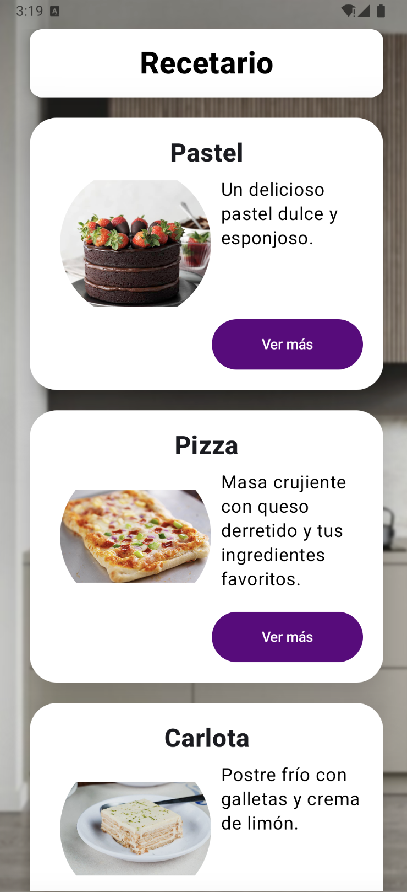
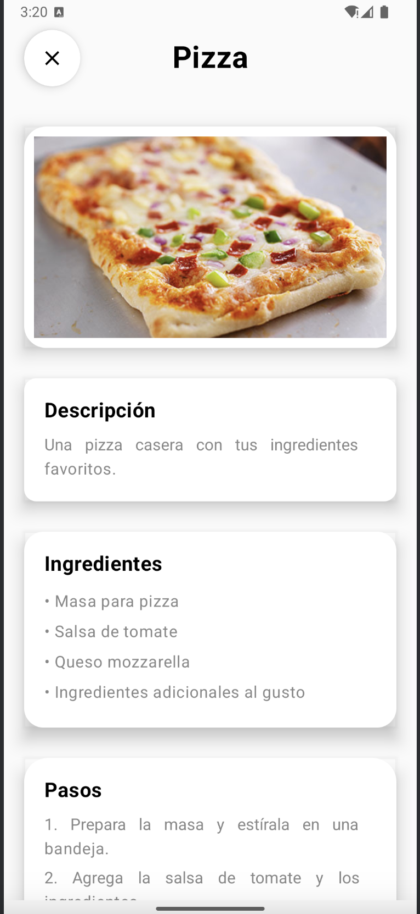
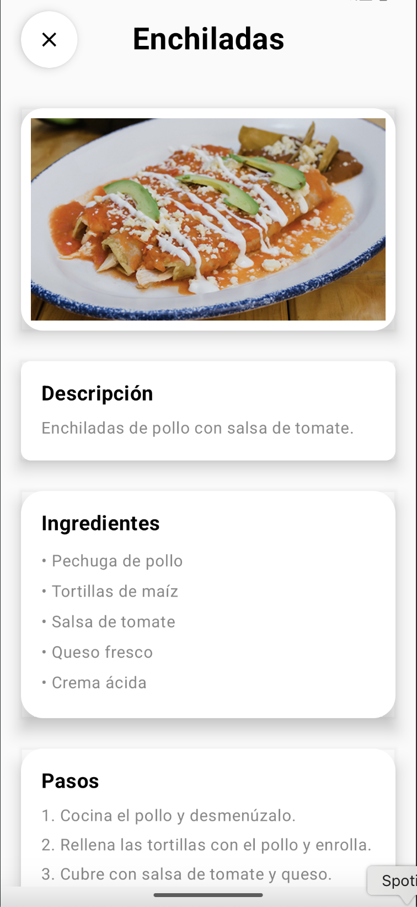

# App de Recetario
## Introducción
El presente proyecto fue realizado como práctica para la materia de desarrollo de aplicaciones en Android.

## Tecnologías utilizadas
- Kotlin

## Capturas de pantalla
### Pantalla de inicio

### Pantallas de recetas

